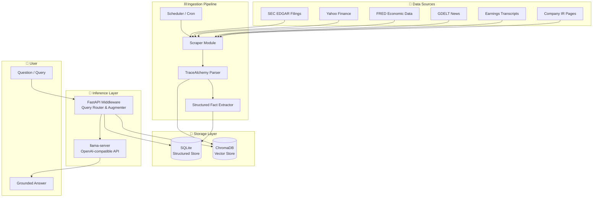
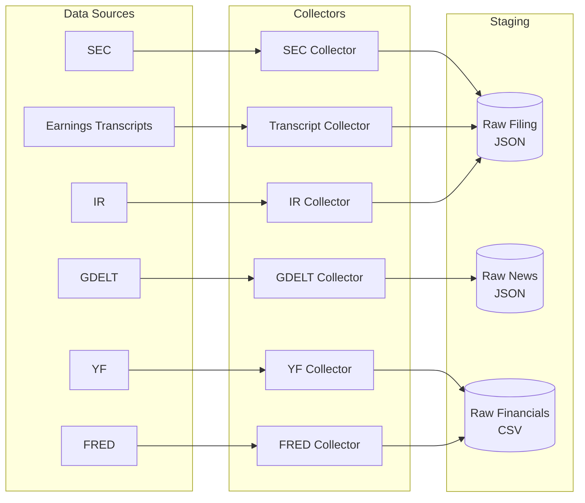
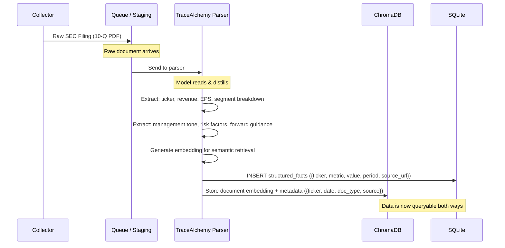
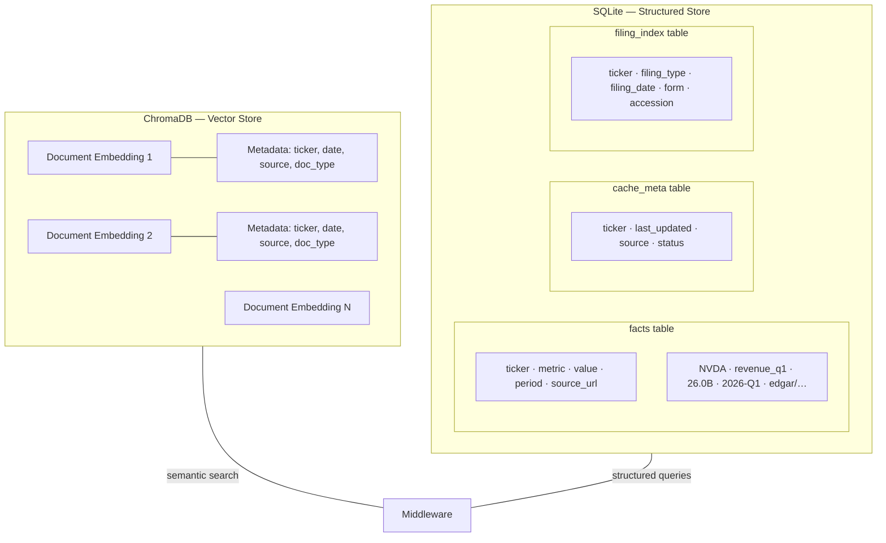
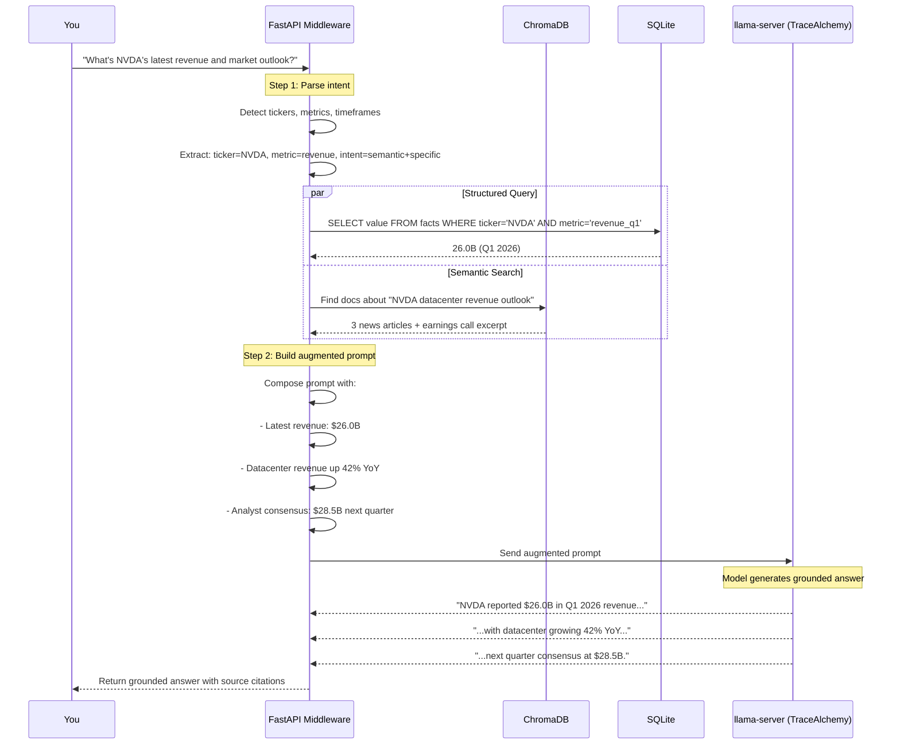
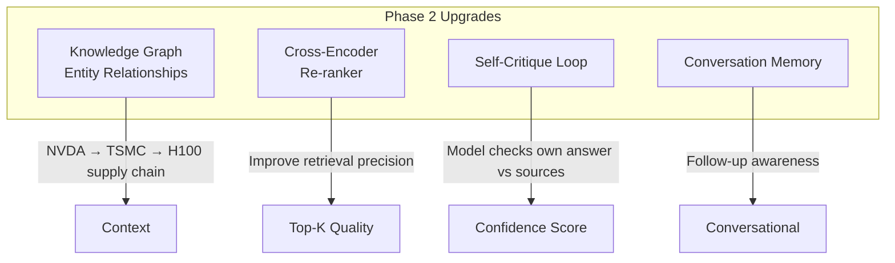

# Gemma-E4B-Finance-RAG

**A hybrid RAG system for financial research powered by a fine-tuned Gemma 4 E4B model.**

Built on top of [trjxter/TraceAlchemy-Gemma-4-E4B-Finance-IT-gguf](https://huggingface.co/trjxter/TraceAlchemy-Gemma-4-E4B-Finance-IT-gguf) — a finance-specialized GGUF model — this system couples real-time data ingestion with a two-tier storage architecture (vector + structured) to deliver grounded, trustworthy answers about stocks, markets, and economic indicators.

---

## Architecture Overview



---

## 1. Fine-Tuned Model — TraceAlchemy

The core reasoning engine is [TraceAlchemy-Gemma-4-E4B-Finance-IT-gguf](https://huggingface.co/trjxter/TraceAlchemy-Gemma-4-E4B-Finance-IT-gguf), a finance-specialized GGUF quant of Google's **Gemma 4 E4B** (2.6B activated / ~9B total parameters, MoE architecture).

**Why this model:**
- Fine-tuned specifically for **financial reasoning** — understands earnings calls, SEC filings, valuation metrics, sector dynamics
- Runs locally via `llama-server` — no API costs, no data leaves your machine
- 128K context window — can process entire filings in one pass
- Multimodal native (text + image + audio) — can parse financial charts and PDFs

The model serves as both the **reasoning engine** (answering questions) and the **data parser** (digesting raw information into structured facts during ingestion).

```
llama-server -m TraceAlchemy-Gemma-4-E4B-Finance-IT.gguf \
  --port 8080 \
  --ctx-size 32768 \
  --n-gpu-layers 99
```

---

## 2. Data Sources — The Source of Truth

The system ingests from free, authoritative sources to build a trustworthy knowledge base:

| Source | API / Method | Data Type | Update Cadence |
|--------|-------------|-----------|----------------|
| **SEC EDGAR** | `sec-api` / direct EDGAR RSS | 10-K, 10-Q, 8-K filings, proxy statements | Real-time on filing |
| **Yahoo Finance** | `yfinance` Python lib | Price data, fundamentals, ratios, news | Daily / on-demand |
| **FRED** (St. Louis Fed) | `fredapi` | GDP, CPI, interest rates, unemployment, yield curves | Varies (daily to quarterly) |
| **GDELT** | `gdelt` Python lib | Global financial news with geo-tags, entities, tone scores | Every 15 minutes |
| **Earnings Transcripts** | Seeking Alpha / Fool.com scraping | Full call transcripts, Q&A | Quarterly |
| **Company IR Pages** | RSS feeds / scraping | Press releases, investor presentations | On-demand |



---

## 3. Ingestion Pipeline — Model-as-Parser

The key innovation: **your fine-tuned model doesn't just answer questions — it reads and digests data before storage**. This is what separates this system from naive chunk-and-embed RAG.



**The parser is a prompt sent to `llama-server` that instructs the model to:**
1. Read the raw document
2. Extract structured facts (ticker, metric, value, date, confidence)
3. Generate a summary embedding
4. Output the extracted facts as structured JSON → stored in SQLite
5. Store the embedding + metadata → stored in ChromaDB

This means every document is **finance-understood**, not just statistically chunked.

---

## 4. Storage Layer — Hybrid Two-Tier



**SQLite Schema (conceptual):**

```sql
-- Structured financial facts
CREATE TABLE facts (
    id INTEGER PRIMARY KEY,
    ticker TEXT NOT NULL,
    metric TEXT NOT NULL,       -- e.g., 'revenue_q1', 'pe_ratio', 'eps_ttm'
    value REAL,
    period TEXT,                -- e.g., '2026-Q1', '2025-FY'
    source_url TEXT,
    source_type TEXT,           -- 'sec', 'yahoo', 'fred'
    ingested_at TIMESTAMP DEFAULT CURRENT_TIMESTAMP,
    UNIQUE(ticker, metric, period)
);

-- Cache freshness tracking
CREATE TABLE cache_meta (
    ticker TEXT PRIMARY KEY,
    last_updated TIMESTAMP,
    next_update TIMESTAMP,
    source TEXT,
    status TEXT                 -- 'fresh', 'stale', 'fetching'
);

-- Filing index for structured lookup
CREATE TABLE filing_index (
    id INTEGER PRIMARY KEY,
    ticker TEXT NOT NULL,
    filing_type TEXT,           -- '10-K', '10-Q', '8-K'
    filing_date DATE,
    form TEXT,
    accession TEXT UNIQUE,
    source_url TEXT
);
```

**Split logic:**
- Vector search → find **relevant documents** semantically
- SQL query → find **precise facts** by ticker, metric, date, source

---

## 5. Query & Augmentation — The Middleware

When you ask a question, the FastAPI middleware routes it through the retrieval pipeline:



The middleware does **three things**:
1. **Intent parsing** — extract tickers, metrics, timeframes, question type
2. **Dual retrieval** — hit SQLite for numbers + ChromaDB for context
3. **Prompt augmentation** — merge retrieved facts into a structured prompt with source citations

---

## 6. Scheduled Updates — Staying Fresh

```mermaid
graph TB
    subgraph Daily["🕐 Daily Schedule"]
        OPEN[Market Open<br/>9:30 AM ET] --> YF_UPDATE[Fetch Yahoo Finance]
        YF_UPDATE --> FRED_UPDATE[Check FRED Updates]
        FRED_UPDATE --> SEC_CHECK[Check SEC Filings<br/>Last 24h]
        SEC_CHECK --> NEWS_CHECK[GDELT News<br/>Last 24h Roundup]
        NEWS_CHECK --> PARSE[Parse All New Data<br/>→ SQLite + ChromaDB]
    end

    subgraph Weekly["📅 Weekly"]
        WEEKEND[Saturday Morning] --> TRANSCRIPTS[Process Earnings<br/>Transcripts]
        TRANSCRIPTS --> FILINGS[Deeper Filing Analysis]
        FILINGS --> CACHE_REFRESH[Refresh Stale Cache Entries]
    end

    subgraph Event["⚡ Event-Driven"]
        SEC_FILING[New SEC Filing<br/>Detected] --> IMMEDIATE[Immediate Parse & Store]
        IR_PRESS[Company Press<br/>Release] --> IMMEDIATE
    end

    subgraph OnDemand["🎯 On-Demand"]
        USER_QUERY[User Asks<br/>About a Stock] --> CACHE_CHECK{Cached Data<br/>Still Fresh?}
        CACHE_CHECK -->|Stale| FETCH[Fetch Latest Data]
        CACHE_CHECK -->|Fresh| SKIP[Use Cache]
        FETCH --> PARSE2[Parse & Store<br/>Before Answering]
        PARSE2 --> ANSWER[Answer with<br/>Fresh Data]
        SKIP --> ANSWER
    end

    Daily --> SQLITE
    Weekly --> SQLITE
    Event --> SQLITE
    OnDemand --> SQLITE
```



**Update strategies:**
- **Market days** — morning fetch of fundamentals, overnight filings, pre-market news
- **Real-time** — SEC filing RSS feed triggers immediate ingestion
- **On-demand via staleness** — querying an unfamiliar ticker triggers a freshness check first; if cached data is >24h old, fetch before answering
- **Weekend batch** — deep dives into earnings transcripts, full document analysis

---

## 7. Running Locally — The Full Stack

The entire system runs locally on your machine (Mac Mini M4 32GB):

```
┌─────────────────────────────────────────────────────────┐
│                    Your Machine                         │
│                                                         │
│  ┌─────────────┐    ┌──────────────┐    ┌───────────┐  │
│  │  llama-server │    │  FastAPI      │    │  Cron/Sched│  │
│  │  (TraceAlchemy) │    │  Middleware    │    │  (Hermes) │  │
│  │  :8080       │    │  :8000        │    │           │  │
│  └──────┬──────┘    └──────┬───────┘    └─────┬─────┘  │
│         │                  │                  │         │
│         ▼                  ▼                  ▼         │
│  ┌───────────┐    ┌──────────────┐    ┌───────────┐  │
│  │ ChromaDB  │    │   SQLite     │    │ Data Queue │  │
│  │ ./chroma/ │    │ ./finance.db │    │ ./staging/ │  │
│  └───────────┘    └──────────────┘    └───────────┘  │
│                                                         │
└─────────────────────────────────────────────────────────┘
```

**Starting the stack:**
```bash
# 1. Serve the model
llama-server -m TraceAlchemy-Gemma-4-E4B-Finance-IT.gguf \
  --port 8080 --ctx-size 32768 --n-gpu-layers 99

# 2. Start the middleware
uvicorn middleware.main:app --port 8000

# 3. Setup cron jobs (via Hermes or systemd timers)
hermes cron create \
  --name "finance-daily-ingest" \
  --schedule "0 9 * * 1-5" \
  --script "scripts/daily_ingest.py"

# 4. Query!
curl localhost:8000/query \
  -d '{"question": "What is NVDA doing with its Blackwell architecture?"}'
```

---

## Phase 2 — Future Evolution

Once Phase 1 is running solidly:



- **Knowledge Graph** — track entities and relationships (companies, suppliers, competitors, customers, regulators)
- **Cross-encoder re-ranker** — boost retrieval accuracy by re-scoring ChromaDB results
- **Self-critique** — have the model verify its own answer against retrieved sources before responding
- **Conversation memory** — track what you've already asked this session so follow-ups have context

---

## Built With

- [TraceAlchemy-Gemma-4-E4B-Finance-IT-gguf](https://huggingface.co/trjxter/TraceAlchemy-Gemma-4-E4B-Finance-IT-gguf) — Finance fine-tuned reasoning engine
- [llama.cpp](https://github.com/ggml-ai/llama.cpp) — Local GGUF inference via `llama-server`
- [ChromaDB](https://www.trychroma.com/) — Vector database for semantic document retrieval
- [SQLite](https://www.sqlite.org/) — Structured financial fact storage
- [FastAPI](https://fastapi.tiangolo.com/) — Middleware API layer
- [SEC EDGAR](https://www.sec.gov/edgar/searchedgar/companysearch.html) — Regulatory filings
- [yfinance](https://github.com/ranaroussi/yfinance) — Market data
- [GDELT](https://www.gdeltproject.org/) — Global news intelligence
- [FRED](https://fred.stlouisfed.org/) — Economic indicators
